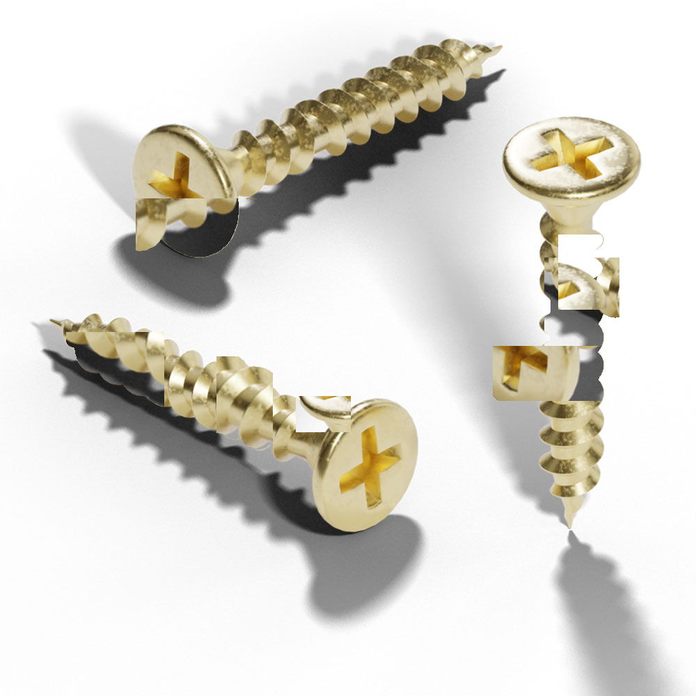
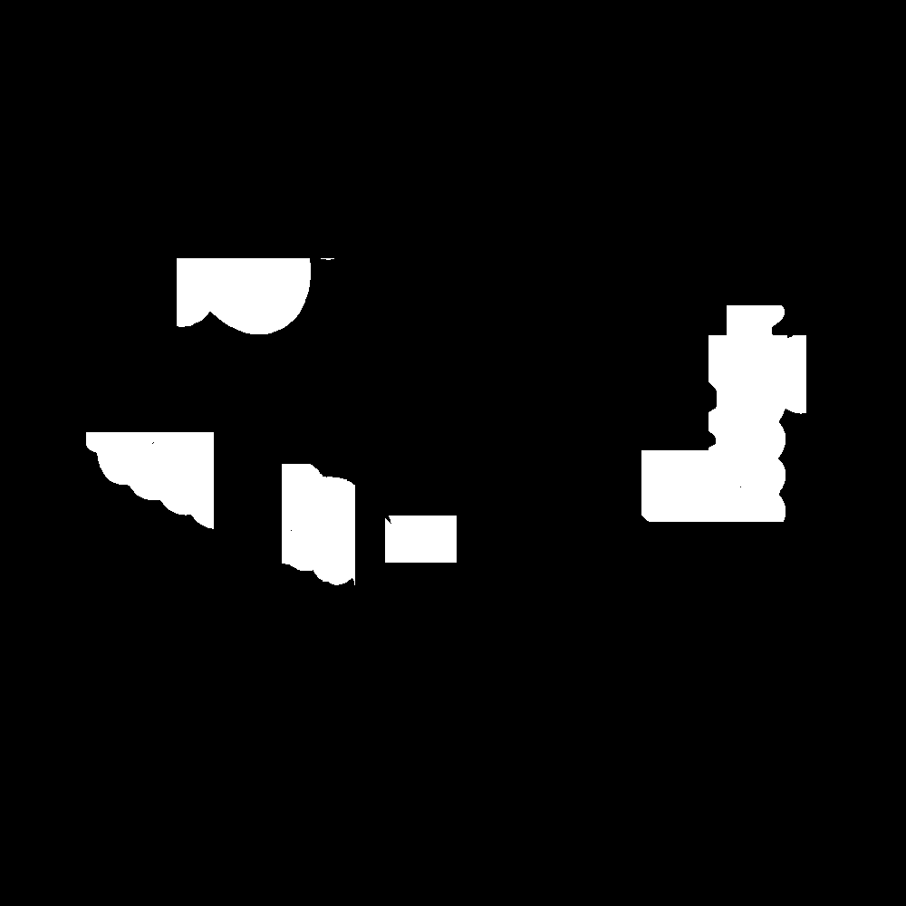

# Mirage Defect
Mirage Defect is designed to generate pseudo defects using [Grounded SAM](https://github.com/IDEA-Research/Grounded-Segment-Anything) and [NSA](https://arxiv.org/abs/2109.15222). This tool is ideal for creating synthetic anomalies for training machine learning models in quality control and inspection scenarios.

| synthesized           | mask           |
|--------------|--------------|
|  |  |

## Requirements
- python == 3.9
- torch >= 2.0.0

For a detailed list of requirements, please refer to [pyproject.toml](pyproject.toml).


## Installation

Before using Mirage Defect, ensure you have all the required dependencies installed. You can install them using the following command:
```:bash
pip install mirage-defect
```

## How to use
Below is an example of how to use Mirage Defect to generate a defect image and mask using two source images and a caption:

```:python
from PIL import Image
from mirage_defect.nsa_generator import NsaGenerator, NsaGeneratorArgs

# Initialize the NSA Generator with specified parameters
generator = NsaGenerator(
  NsaGeneratorArgs(
    mode="uniform", shift=True, resize=True, num_patches=10
  )
)

# Load source images
x1 = Image.open("screw_1.jpg")
x2 = Image.open("screw_2.jpg")
caption = "screw"

# Generate the defect image and mask
image, mask = generator.generate(x1, x2, caption)
```

This script demonstrates the basic usage of Mirage Defect. Modify the parameters and inputs as needed for your specific use case.
